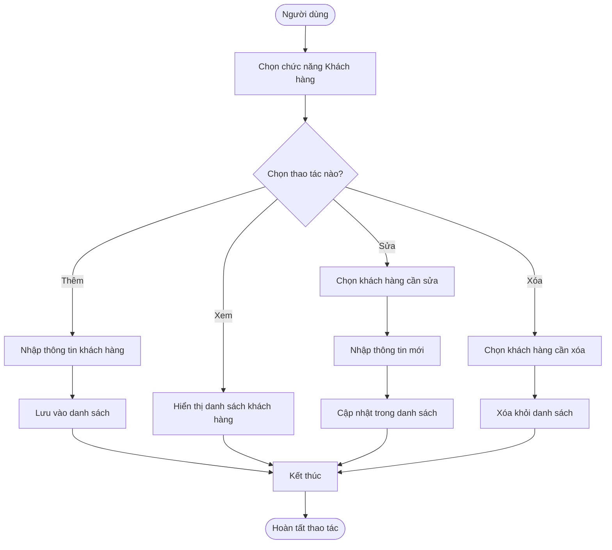
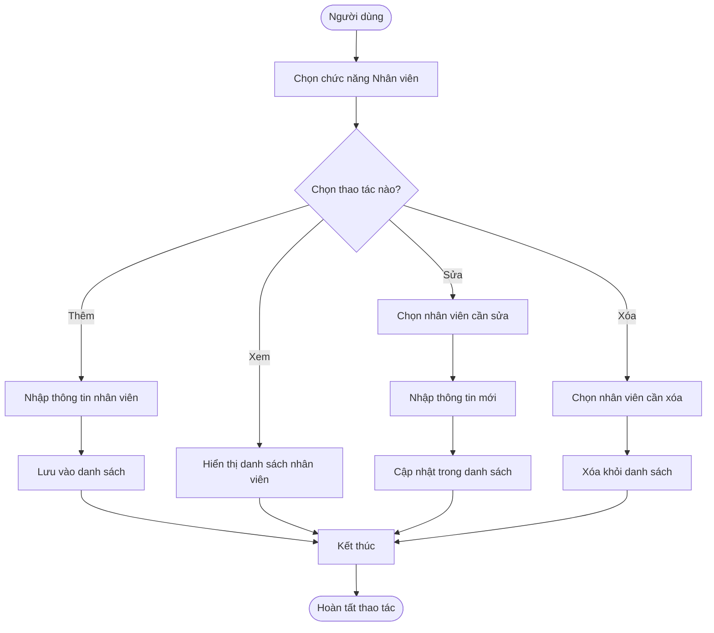
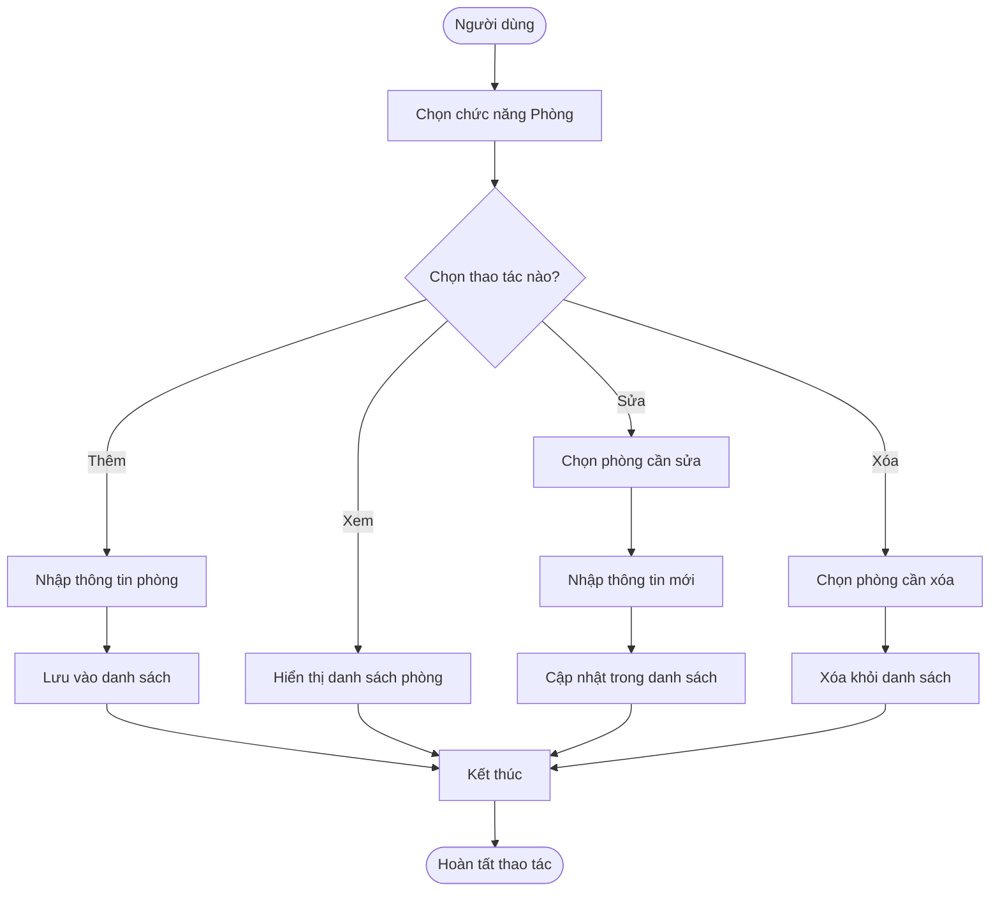

# Phần mềm quản lý khách sạn
## Đối tượng sử dụng
- Lễ tân: Quản lý đặt phòng, nhận/trả phòng, tra cứu thông tin khách.

- Quản lý khách sạn: Theo dõi doanh thu, công suất phòng, báo cáo hoạt động.

- Nhân viên phục vụ: Cập nhật tình trạng phòng (sạch, bẩn, đang dọn...), yêu cầu dịch vụ.

- Khách hàng (nếu có chức năng tự đặt phòng): Tìm kiếm, đặt phòng, thanh toán trực tuyến.

## Chức năng chính
- Quản lý đặt phòng (check-in / check-out).

- Quản lý thông tin khách hàng.

- Quản lý loại phòng và tình trạng phòng.

- Quản lý dịch vụ đi kèm (ăn uống, giặt ủi, xe đưa đón...).

- Tính tiền, hóa đơn, và thanh toán.

- Quản lý nhân sự, phân công công việc.

- Báo cáo doanh thu, công suất sử dụng phòng.

- Hệ thống phân quyền người dùng theo vai trò.

## Lý do được xây dựng
- Hạn chế thao tác thủ công và giấy tờ trong việc quản lý khách sạn.

- Tăng tính chính xác trong đặt phòng, tính tiền, và theo dõi dịch vụ.

- Giúp quản lý dễ dàng giám sát tình hình hoạt động mọi lúc, mọi nơi.

- Nâng cao chất lượng phục vụ và trải nghiệm khách hàng.

## Hướng tiếp cận
- Tập trung vào trải nghiệm người dùng: Giao diện dễ sử dụng cho nhân viên không chuyên về công nghệ.

- Hướng tiếp cận module hóa: Mỗi chức năng (phòng, dịch vụ, khách hàng...) được phát triển riêng biệt để dễ nâng cấp.

- Phát triển đa nền tảng: Hỗ trợ cả máy tính và thiết bị di động (tablet, điện thoại).

- Tích hợp: Có thể tích hợp với hệ thống khóa cửa thông minh, thanh toán điện tử, phần mềm kế toán,...

## Những chức năng tối thiểu cần có
- Đăng nhập / phân quyền người dùng.

- Đặt phòng, trả phòng (check-in / check-out).

- Quản lý danh sách phòng và trạng thái phòng.

- Quản lý thông tin khách hàng.

- Quản lý hóa đơn và thanh toán.

- Báo cáo doanh thu, thống kê tình trạng sử dụng phòng.

## Công nghệ sử dụng 
- Phầm mềm hỗ trợ phân tích thiết kế hệ thống
- Microsoft Word: Viết tài liệu đặc tả hệ thống
- RAW.IO: Vẽ các biểu đồ Use case,Sequence,Activity và Class
- Intellij idea: Viết source code backend và chạy demo app

- Kết nối Intellij idea với database là Hotel.sql và chạy demo .

# Đối tượng Khách Hàng
public class KhachHang {
    private int id;
    private String ten;
    private String soCMND;
    private String soDienThoai;

    // Constructor không tham số
    public KhachHang() {}

    // Constructor có tham số
    public KhachHang(int id, String ten, String soCMND, String soDienThoai) {
        this.id = id;
        this.ten = ten;
        this.soCMND = soCMND;
        this.soDienThoai = soDienThoai;
    }

    // Getter và Setter
    public int getId() {
        return id;
    }
    public void setId(int id) {
        this.id = id;
    }

    public String getTen() {
        return ten;
    }
    public void setTen(String ten) {
        this.ten = ten;
    }

    public String getSoCMND() {
        return soCMND;
    }
    public void setSoCMND(String soCMND) {
        this.soCMND = soCMND;
    }

    public String getSoDienThoai() {
        return soDienThoai;
    }
    public void setSoDienThoai(String soDienThoai) {
        this.soDienThoai = soDienThoai;
    }
}
import java.util.ArrayList;
import java.util.List;

public class KhachHangDAO {
    private List<KhachHang> danhSach = new ArrayList<>();

    // Create
    public void themKhachHang(KhachHang kh) {
        danhSach.add(kh);
    }

    // Read
    public List<KhachHang> layTatCa() {
        return danhSach;
    }

    // Update
    public void suaKhachHang(int id, KhachHang khMoi) {
        for (int i = 0; i < danhSach.size(); i++) {
            if (danhSach.get(i).getId() == id) {
                danhSach.set(i, khMoi);
                break;
            }
        }
    }

    // Delete
    public void xoaKhachHang(int id) {
        danhSach.removeIf(kh -> kh.getId() == id);
    }
}

## Activity Diagram – Quản lý Khách hàng

# Đối tượng Nhân Viên :
import java.util.HashMap;

public class NhanVien {
    private int id;
    private String ten;

    public NhanVien(int id, String ten) {
        this.id = id;
        this.ten = ten;
    }

    public int getId() { return id; }
    public String getTen() { return ten; }
    public void setTen(String ten) { this.ten = ten; }

    @Override
    public String toString() {
        return "NhanVien{id=" + id + ", ten='" + ten + "'}";
    }
}

public class QuanLyNhanVien {
    private HashMap<Integer, NhanVien> dsNhanVien = new HashMap<>();

    public void them(NhanVien nv) {
        dsNhanVien.put(nv.getId(), nv);
    }

    public void xem() {
        dsNhanVien.values().forEach(System.out::println);
    }

    public void sua(int id, String tenMoi) {
        if (dsNhanVien.containsKey(id)) {
            dsNhanVien.get(id).setTen(tenMoi);
        }
    }

    public void xoa(int id) {
        dsNhanVien.remove(id);
    }
}
public class MainNhanVien {
    public static void main(String[] args) {
        QuanLyNhanVien ql = new QuanLyNhanVien();
        ql.them(new NhanVien(1, "Nguyen Van Phuc"));
        ql.them(new NhanVien(2, "Nguyen Trung Quyen"));

        System.out.println("Danh sach nhan vien:");
        ql.xem();

        ql.sua(1, "Nguyen Van Phuc (Updated)");
        ql.xoa(2);

        System.out.println("Sau khi cap nhat:");
        ql.xem();
    }
}
## Activity Diagram – Quản lý nhân viên

# Đối tượng Phòng :

import java.util.HashMap;

public class Phong {
    private int id;
    private String ten;

    public Phong(int id, String ten) {
        this.id = id;
        this.ten = ten;
    }

    public int getId() { return id; }
    public String getTen() { return ten; }
    public void setTen(String ten) { this.ten = ten; }

    @Override
    public String toString() {
        return "Phong{id=" + id + ", ten='" + ten + "'}";
    }
}

public class QuanLyPhong {
    private HashMap<Integer, Phong> dsPhong = new HashMap<>();

    public void them(Phong p) {
        dsPhong.put(p.getId(), p);
    }

    public void xem() {
        dsPhong.values().forEach(System.out::println);
    }

    public void sua(int id, String tenMoi) {
        if (dsPhong.containsKey(id)) {
            dsPhong.get(id).setTen(tenMoi);
        }
    }

    public void xoa(int id) {
        dsPhong.remove(id);
    }
}
public class MainPhong {
    public static void main(String[] args) {
        QuanLyPhong ql = new QuanLyPhong();
        ql.them(new Phong(1, "Phong A"));
        ql.them(new Phong(2, "Phong B"));

        System.out.println("Danh sach phong:");
        ql.xem();

        ql.sua(1, "Phong A (Updated)");
        ql.xoa(2);

        System.out.println("Sau khi cap nhat:");
        ql.xem();
    }
}
## Activity Diagram – Quản lý phòng

